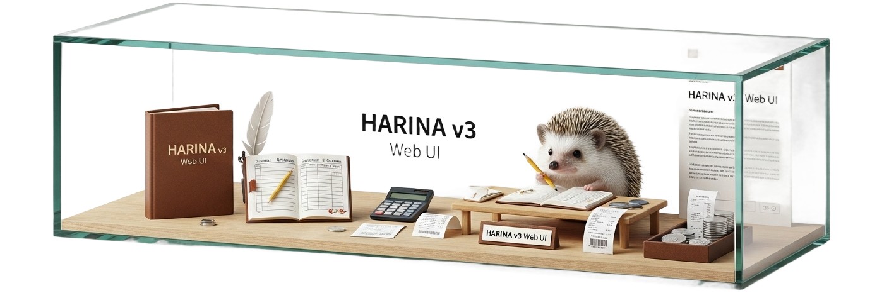

<p align="center">
  
</p>

<h1 align="center">🧾 Receipt Recognition App with HARINA CLI</h1>

<p align="center">
  
  
  
  
  
  
</p>

HARINAのCLIをバックエンドにしたDocker-composeベースのレシート認識アプリです。

## 🏗️ アーキテクチャ

- **Backend**: HARINA v3 CLI (FastAPI) - レシート認識API
- **Frontend**: React + TypeScript - ユーザーインターフェース  
- **Database**: PostgreSQL - レシートデータ保存
- **Discord Bot**: discord.py - Discordからの画像投稿を受け付け
- **Container**: Docker Compose - 統合環境

## 🚀 クイックスタート

### 🔑 1. 環境変数の設定

```bash
cp .env.example .env
```

`.env`ファイルを編集してAPIキーを設定：

```env
# 必須: 使用するAIプロバイダーのAPIキーを設定
GEMINI_API_KEY=your_gemini_api_key_here
OPENAI_API_KEY=your_openai_api_key_here
ANTHROPIC_API_KEY=your_anthropic_api_key_here
```

### 🔒 1.5 HTTPS用証明書の準備（nginxリバースプロキシ）

`docker-compose` には HTTPS 対応の nginx リバースプロキシが含まれています。公開環境では信頼できる
証明書を、開発環境では自己署名証明書を下記のパスに配置してください。

```text
nginx/certs/fullchain.pem   # サーバー証明書 (チェーン付き)
nginx/certs/privkey.pem     # 秘密鍵
```

自己署名証明書を生成する場合は次のコマンドが利用できます。

```bash
openssl req -x509 -nodes -newkey rsa:4096 \
  -keyout nginx/certs/privkey.pem \
  -out nginx/certs/fullchain.pem \
  -days 365 \
  -subj "/CN=localhost"
```

ブラウザで警告が表示される場合は、生成した証明書を信頼済みに追加してください。

### 🤖 1.6 Discordボット用環境変数の設定（任意）

Discordから画像をアップロードしたい場合は、`.env` にボットのトークン等を設定します。

```env
DISCORD_BOT_TOKEN=your_discord_bot_token_here
DISCORD_ALLOWED_CHANNEL_IDS=123456789012345678  # カンマ区切りで複数指定可
DISCORD_RECEIPT_MODEL=gemini
DISCORD_RECEIPT_UPLOADER=discord
DISCORD_CHANNEL_UPLOADERS=v3_maki:maki,v3_yome:yome
DISCORD_RECEIPT_BASE_URL=https://localhost
```

> **注意:** DiscordのBot設定で「MESSAGE CONTENT INTENT」を有効にし、添付ファイルを扱うチャンネルIDを指定すると誤反応を防げます。

`DISCORD_CHANNEL_UPLOADERS` に `チャンネル名:アップローダー` の形式で指定すると、チャンネル単位でアップロード者名を上書きできます（カンマ区切りで複数指定可）。例では `#v3_maki` に投稿された画像は `maki`、`#v3_yome` は `yome` として保存されます。

`DISCORD_RECEIPT_BASE_URL` を設定すると、Discordのスレッド内に登録済みレシートの共有URL（例: `https://localhost/receipts/123`）が自動で表示されます。

複数画像を同時に投稿した場合は、それぞれ個別の進捗メッセージが同じスレッドに投稿され、解析結果が順次表示されます。処理完了後はスレッドが自動でアーカイブされます。

### 2. アプリケーションの起動

```bash
# Docker Composeでアプリケーション全体を起動
docker-compose up --build
```

### 🌐 3. アクセス

- **フロントエンド (nginx経由)**: https://localhost
- **フロントエンド (開発用ポート直接)**: http://localhost:3010
- **バックエンドAPI (harina)**: http://localhost:8001
- **API ドキュメント**: http://localhost:8001/docs
- **データベース管理UI**: http://localhost:3001

## 📱 機能

### 💻 フロントエンド (React + TypeScript)
- ドラッグ&ドロップでレシート画像アップロード
- リアルタイム処理進捗表示
- AIモデル選択（Gemini、GPT-4o、Claude）
- レシート詳細表示（店舗情報、商品一覧、合計金額）
- レシート履歴一覧（データベース連携）
- リアルタイム統計情報表示
- レスポンシブデザイン
- `/receipts/{id}` の共有URLでレシート詳細を参照可能

### 🧠 バックエンド (HARINA CLI)
- 複数AIモデル対応
- XML/CSV形式出力
- RESTful API
- 高速画像処理

### 🗄️ データベース (PostgreSQL)
- レシート情報永続化
- 商品情報管理
- 履歴機能

### Discordボット
- 画像添付を検知してレシート解析をトリガー（1メッセージ内の複数画像にも対応）
- 解析結果（店舗名・合計金額・アイテム）をチャンネルへ返信
- チャンネルIDで対象範囲を制御可能
- レシート登録後は共有URLをスレッドに自動投稿

## 🛠️ 開発

### 🔄 個別サービスの起動

```bash
# バックエンドのみ
docker-compose up backend postgres

# フロントエンドのみ（開発モード）
cd frontend
npm install
npm start
```

### 📋 ログの確認

```bash
# 全サービスのログ
docker-compose logs -f

# 特定サービスのログ
docker-compose logs -f backend
docker-compose logs -f frontend
docker-compose logs -f postgres
```

### Discordボットの開発メモ

```bash
# Discordボットのみローカルで起動
cd discord-bot
python -m venv .venv
source .venv/bin/activate  # Windows は .venv\\Scripts\\activate
pip install -r requirements.txt
export DISCORD_BOT_TOKEN=your-token
python bot.py
```

> Docker Compose でサービスを起動すると `discord-bot` コンテナが自動で立ち上がります。

## 📁 プロジェクト構造

```
├── docker-compose.yml          # Docker Compose設定
├── .env.example               # 環境変数テンプレート
├── backend/
│   └── Dockerfile            # HARINAベースのバックエンド
├── frontend/                 # React + TypeScript フロントエンド
│   ├── src/
│   │   ├── components/       # Reactコンポーネント
│   │   ├── services/         # API通信
│   │   ├── types/           # TypeScript型定義
│   │   └── App.tsx          # メインアプリ
│   ├── package.json
│   └── Dockerfile
└── database/
    └── init.sql             # データベース初期化
```

## 🔧 カスタマイズ

### 🧩 AIモデルの追加

`frontend/src/components/ReceiptUpload.tsx`でモデル選択肢を編集：

```typescript
<option value="new-model">New Model</option>
```

### 🎨 UIのカスタマイズ

Tailwind CSSを使用しているため、`frontend/src/`内のコンポーネントで簡単にスタイル変更可能。

## 🐛 トラブルシューティング

### ❗ よくある問題

1. **APIキーエラー**
   - `.env`ファイルでAPIキーが正しく設定されているか確認

2. **Docker起動エラー**
   - ポート3000, 8000, 5432が使用されていないか確認
   - `docker-compose down`で既存コンテナを停止

3. **画像アップロードエラー**
   - 対応形式: JPEG, PNG, GIF, BMP
   - ファイルサイズ制限を確認

### 🧐 ログ確認

```bash
# エラーログの確認
docker-compose logs backend | grep ERROR
docker-compose logs frontend | grep ERROR
```

## 📄 ライセンス

MIT License

## 🤝 コントリビューション

1. このリポジトリをフォーク
2. フィーチャーブランチを作成
3. 変更をコミット
4. プルリクエストを作成

## 📞 サポート

問題や質問がある場合は、GitHubのIssuesで報告してください。
